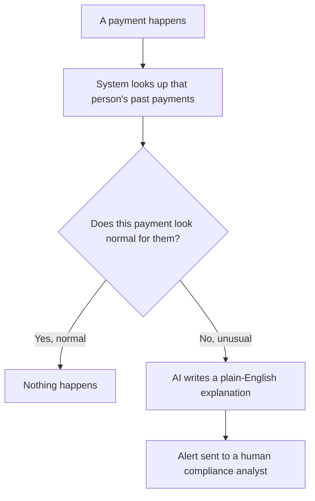
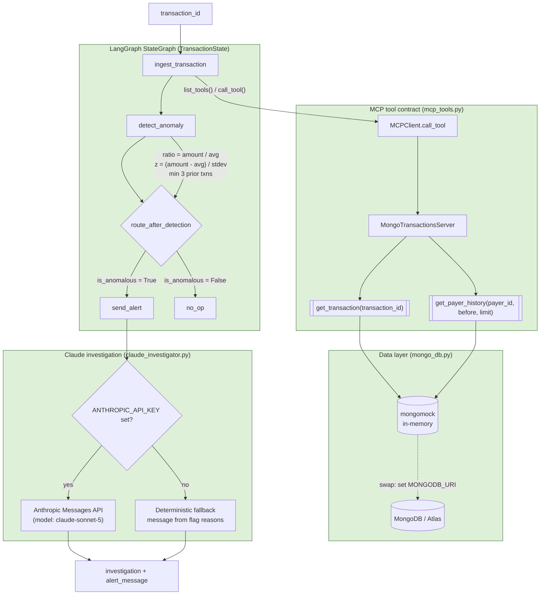
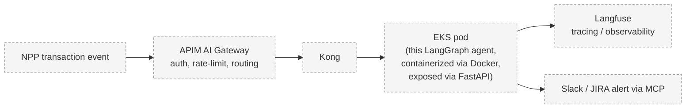

# Visual Flow

Two views of the same system: one for anyone, one for engineers. Both
diagrams render directly on GitHub (Mermaid).

---

## 1. In plain terms

**What each box means:**

- **A payment happens** — someone sends money through the NPP (New
  Payments Platform, Australia's real-time bank transfer rail).
- **System looks up that person's past payments** — before judging
  anything, it pulls up how this specific person or business usually pays:
  how much, how often.
- **Does this payment look normal for them?** — this is a math check, not
  a guess. It compares the new payment to that person's own average and
  typical variation. A $61,000 payment can be perfectly normal for a
  business that always pays around $57,000, while a $9,800 payment can be
  very unusual for someone who normally pays under $1,000.
- **Nothing happens** — most payments are fine, so most of the time the
  system does nothing. No noise, no false alarms.
- **AI writes a plain-English explanation** — for the rare unusual
  payment, an AI (Claude) reads the transaction and the history and writes
  a short note: *why* this looks off, in normal language, not just numbers.
- **Alert sent to a human compliance analyst** — a person makes the final
  call. The AI never decides to block or approve anything by itself, and
  it never decides *which* payments are flagged in the first place — the
  math does that. The AI only helps explain what the math already found.

---

## 2. Full technical architecture

**Planned production wrapping (Sessions 4–7, not built yet):**

**Component notes:**

- **TransactionState** — a `TypedDict` LangGraph threads through every
  node; each node returns only the keys it changes, and LangGraph merges
  them into the running state.
- **Conditional edge (`route_after_detection`)** — a plain function
  returning a string key (`"send_alert"` or `"no_op"`), which LangGraph
  uses to pick the next node. This is the only branch point in the graph.
- **MCP contract** — `MCPClient` never touches pymongo directly. It calls
  `call_tool(name, **kwargs)`, which round-trips through the same
  `{"content": [...], "isError": bool}` envelope a real MCP server would
  return. Swapping `MongoTransactionsServer` for a networked MCP server
  requires no change in `ingest_transaction`.
- **Detection thresholds** — flags when the amount is both ≥3x the
  payer's historical average *and* ≥3 standard deviations above it, with
  a minimum of 3 prior transactions to trust the baseline at all. Purely
  arithmetic — no model in the loop.
- **Claude investigation** — only ever called on transactions already
  flagged by the step above. `ANTHROPIC_API_KEY` presence is the runtime
  switch between a live Claude call and a deterministic string fallback,
  so the graph is fully runnable (and free) with no key configured.
- **Data layer swap** — `get_collection()` returns a `mongomock`
  collection unless `MONGODB_URI` is set, in which case it returns a real
  `pymongo` collection instead. Every caller uses the same `Collection`
  API either way.
